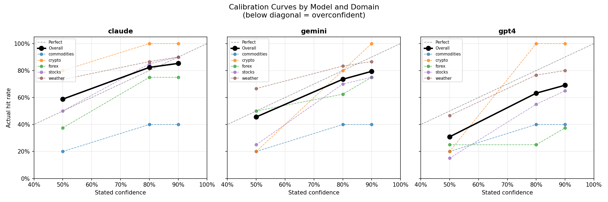
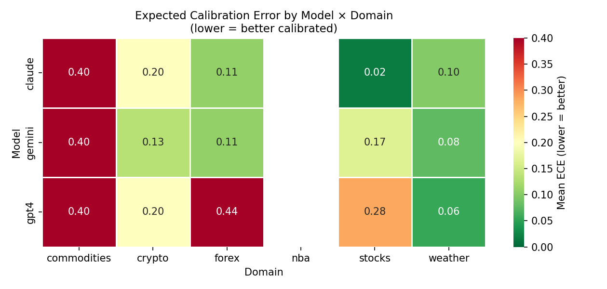
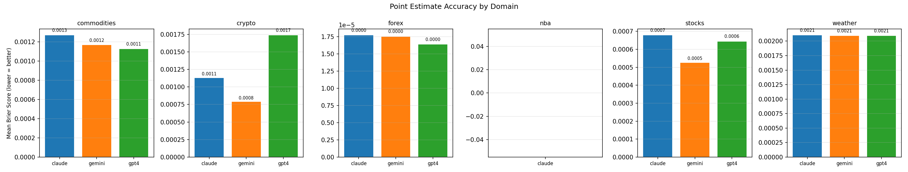
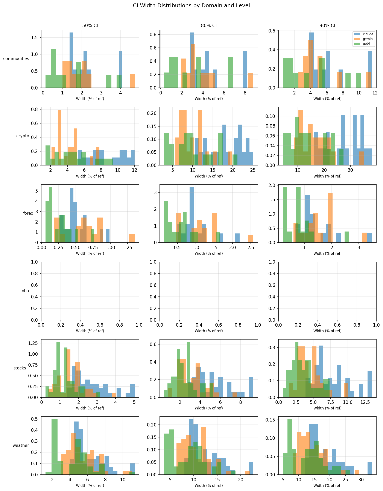

# AI Model Overconfidence Report — Multi-Domain

**Generated:** 2026-03-26  
**Domains:** commodities, crypto, forex, nba, stocks, weather  
**Models:** claude, gemini, gpt4

---

## Overall Calibration Summary

A well-calibrated model's empirical hit rates should match its stated confidence levels.  
Hit rates **below** stated confidence indicate **overconfidence** (intervals too narrow).

| Model | N | Hit@50% | Hit@80% | Hit@90% | Mean ECE |
|-------|---|---------|---------|---------|----------|
| claude | 68 | 58.8% | 82.4% | 85.3% | 5.3% |
| gemini | 68 | 45.6% | 73.5% | 79.4% | 7.2% |
| gpt4 | 68 | 30.9% | 63.2% | 69.1% | 18.9% |

*(Perfect calibration: 50%/80%/90% hit rates. Lower ECE = better.)*

---

## Per-Domain Breakdown

### Commodities

| Model | N | Hit@50% | Hit@80% | Hit@90% | ECE |
|-------|---|---------|---------|---------|-----|
| claude | 10 | 20.0% | 40.0% | 40.0% | 40.0% |
| gemini | 10 | 20.0% | 40.0% | 40.0% | 40.0% |
| gpt4 | 10 | 20.0% | 40.0% | 40.0% | 40.0% |

**claude**: 50% CI: severely overconfident (hit 20.0% vs stated 50%); 80% CI: severely overconfident (hit 40.0% vs stated 80%); 90% CI: severely overconfident (hit 40.0% vs stated 90%)  
**gemini**: 50% CI: severely overconfident (hit 20.0% vs stated 50%); 80% CI: severely overconfident (hit 40.0% vs stated 80%); 90% CI: severely overconfident (hit 40.0% vs stated 90%)  
**gpt4**: 50% CI: severely overconfident (hit 20.0% vs stated 50%); 80% CI: severely overconfident (hit 40.0% vs stated 80%); 90% CI: severely overconfident (hit 40.0% vs stated 90%)  

### Crypto

| Model | N | Hit@50% | Hit@80% | Hit@90% | ECE |
|-------|---|---------|---------|---------|-----|
| claude | 20 | 80.0% | 100.0% | 100.0% | 20.0% |
| gemini | 20 | 20.0% | 80.0% | 100.0% | 13.3% |
| gpt4 | 20 | 20.0% | 100.0% | 100.0% | 20.0% |

**claude**: 50% CI: underconfident (hit 80.0% vs stated 50%); 80% CI: underconfident (hit 100.0% vs stated 80%); 90% CI: underconfident (hit 100.0% vs stated 90%)  
**gemini**: 50% CI: severely overconfident (hit 20.0% vs stated 50%); 80% CI: well-calibrated (hit 80.0% vs stated 80%); 90% CI: underconfident (hit 100.0% vs stated 90%)  
**gpt4**: 50% CI: severely overconfident (hit 20.0% vs stated 50%); 80% CI: underconfident (hit 100.0% vs stated 80%); 90% CI: underconfident (hit 100.0% vs stated 90%)  

### Forex

| Model | N | Hit@50% | Hit@80% | Hit@90% | ECE |
|-------|---|---------|---------|---------|-----|
| claude | 16 | 37.5% | 75.0% | 75.0% | 10.8% |
| gemini | 16 | 50.0% | 62.5% | 75.0% | 10.8% |
| gpt4 | 16 | 25.0% | 25.0% | 37.5% | 44.2% |

**claude**: 50% CI: moderately overconfident (hit 37.5% vs stated 50%); 80% CI: moderately overconfident (hit 75.0% vs stated 80%); 90% CI: severely overconfident (hit 75.0% vs stated 90%)  
**gemini**: 50% CI: well-calibrated (hit 50.0% vs stated 50%); 80% CI: severely overconfident (hit 62.5% vs stated 80%); 90% CI: severely overconfident (hit 75.0% vs stated 90%)  
**gpt4**: 50% CI: severely overconfident (hit 25.0% vs stated 50%); 80% CI: severely overconfident (hit 25.0% vs stated 80%); 90% CI: severely overconfident (hit 37.5% vs stated 90%)  

### Nba

| Model | N | Hit@50% | Hit@80% | Hit@90% | ECE |
|-------|---|---------|---------|---------|-----|
| claude | 13 | N/A | N/A | N/A | N/A |
| gemini | 13 | N/A | N/A | N/A | N/A |
| gpt4 | 13 | N/A | N/A | N/A | N/A |

### Stocks

| Model | N | Hit@50% | Hit@80% | Hit@90% | ECE |
|-------|---|---------|---------|---------|-----|
| claude | 40 | 50.0% | 85.0% | 90.0% | 1.7% |
| gemini | 40 | 25.0% | 70.0% | 75.0% | 16.7% |
| gpt4 | 40 | 15.0% | 55.0% | 65.0% | 28.3% |

**claude**: 50% CI: well-calibrated (hit 50.0% vs stated 50%); 80% CI: well-calibrated (hit 85.0% vs stated 80%); 90% CI: well-calibrated (hit 90.0% vs stated 90%)  
**gemini**: 50% CI: severely overconfident (hit 25.0% vs stated 50%); 80% CI: moderately overconfident (hit 70.0% vs stated 80%); 90% CI: severely overconfident (hit 75.0% vs stated 90%)  
**gpt4**: 50% CI: severely overconfident (hit 15.0% vs stated 50%); 80% CI: severely overconfident (hit 55.0% vs stated 80%); 90% CI: severely overconfident (hit 65.0% vs stated 90%)  

### Weather

| Model | N | Hit@50% | Hit@80% | Hit@90% | ECE |
|-------|---|---------|---------|---------|-----|
| claude | 60 | 73.3% | 86.7% | 90.0% | 10.0% |
| gemini | 60 | 66.7% | 83.3% | 86.7% | 7.8% |
| gpt4 | 60 | 46.7% | 76.7% | 80.0% | 5.5% |

**claude**: 50% CI: underconfident (hit 73.3% vs stated 50%); 80% CI: underconfident (hit 86.7% vs stated 80%); 90% CI: well-calibrated (hit 90.0% vs stated 90%)  
**gemini**: 50% CI: underconfident (hit 66.7% vs stated 50%); 80% CI: well-calibrated (hit 83.3% vs stated 80%); 90% CI: well-calibrated (hit 86.7% vs stated 90%)  
**gpt4**: 50% CI: well-calibrated (hit 46.7% vs stated 50%); 80% CI: well-calibrated (hit 76.7% vs stated 80%); 90% CI: moderately overconfident (hit 80.0% vs stated 90%)  

---
## Charts

**Calibration Curves** — stated confidence vs empirical hit rate by domain.

**ECE Heatmap** — miscalibration by model and domain.

**Brier Scores** — normalised point estimate accuracy per domain.

**CI Width Distributions** — width of confidence intervals as % of reference value.

---
## Methodology

1. **Domains**: Stocks (yfinance), Crypto (CoinGecko), Weather (Open-Meteo), NBA (ESPN), Forex (yfinance), Commodities (yfinance).
2. **Collection**: Each model is prompted with current context and asked for a point estimate plus 50/80/90% confidence intervals.
3. **Ground truth**: Actual outcomes fetched the following day from each domain's API.
4. **Hit rate**: Fraction of predictions where the actual value fell within the stated interval.
5. **Brier score**: Normalised mean squared error `((predicted - actual) / reference)²`.
6. **ECE**: Mean absolute gap between stated confidence and empirical hit rate.

*This experiment does not constitute financial or any other professional advice.*